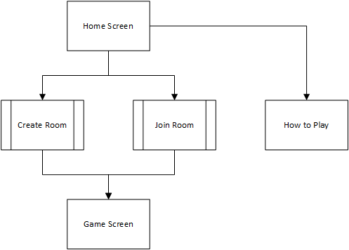

# Hanabi
### Functional Specification

Ian Fox

Last updated September 20, 2016

## Overview

**Disclaimer:** This spec is not complete. Wording will be changed. Layouts will be changed. This is a living document that will be updated.

This project, in its first iteration, will aim simply to be a simulation of the physical card game.

## Scenarios
Ian likes playing Hanabi. He has some friends he wants to play with, but he's in bed and doesn't want to get dressed to go out and play. He goes to the Hanabi app, creates a room, and sends the room code to his friends so they can join him.

## Nongoals
This version of the application will not support:
* AI Teammates
* Main lobby chat
* Security on games (eg trying to access a game you aren't in fails)

## Details

### Screens

### Gameplay
Users will be able to:

* Perform the three basic actions of the game, as appropriate
* See other players' hands
* See whose turn it is

### Game Options
The following options are available on each game:
* Public: True if the game is listed under all games, for random strangers to join  
* "Perfect Mode": True if the game should be scored as binary (did you get a perfect score or not)  
* "Chameleon Mode": False if the rainbow is a colour you can name for hints. Otherwise, a hint about a colour will also point out any rainbow cards.  
* "Hard Mode": True if there's only one copy of each rainbow card, rather than the standard three 1's, one 5, and two of everything else.

## Open Issues
Any issues still up for debate will be documented here.
